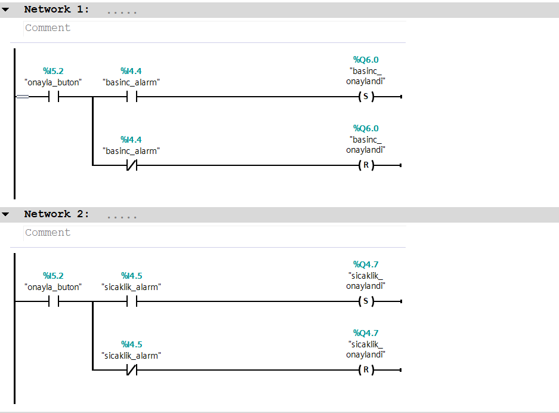
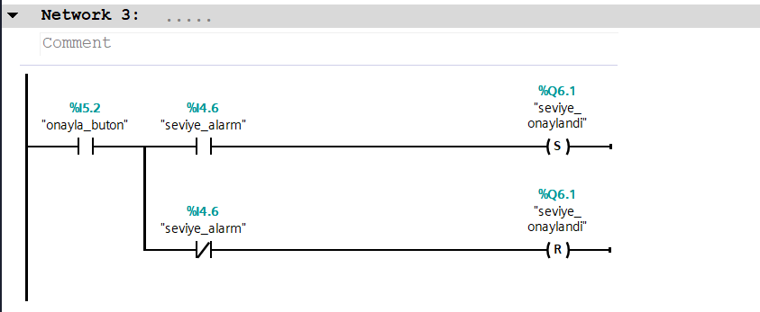
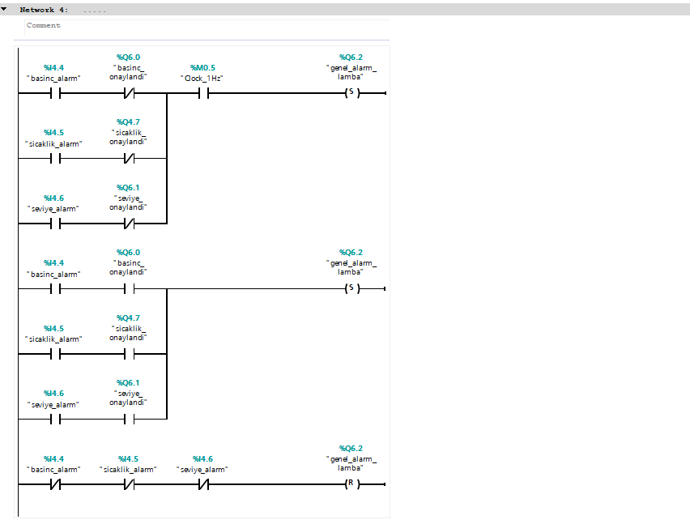

If any of the 3 alarms is true, the alarm light flashes.
When the operator acknowledges that alarm, its light stops flashing and stays steady until the fault clears, then turns off.If a new, unacknowledged alarm occurs while another is already acknowledged, the light starts flashing again.
